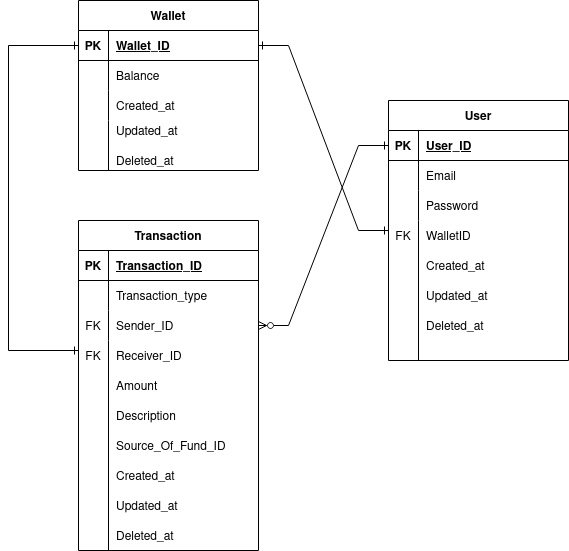

### assignment-golang-backend

Project Description

===================

Golang E-Wallet Back End Implementation

Features Completed

------------------

1. General Features

- [x] Wrong endpoint request should return 404 with standard response format

- [x] Follow RESTful Guideline

- [x] Response uses similar format to Library API

- [x] Wallet number prefix (123xxx) is set in database and auto increment

2. Authentication and Authorization

- [x] **Register** email and password (hashed in db)

- [x] **Login** email and password (returns JWT)

- [x] **Auth** API excluding login register must have JWT validated

- [] _Optional_ **Reset Password**

3. List of Transactions

- [x] **Show All** Default show last 10 transactions of logged in users

- [x] **Sort** Order by date, amount, to (recipients). Sort by asc desc.

- [x] **Search** Search transaction by description

- [] _Optional_ **Pagination**

4. Topup

- [x] **Top Up** Add topup transaction history of user

5. Transfer

- [x] **Transfer** Add transfer transaction history of user

6. User Details

- [x] **Show Detail** Shows user email, wallet number and balance

7. SQL

- [x] **Create Tables**

- [x] **Create Dummy Data**

8. Unit Testing

- [ ] **Add Tests for Testable Functions**

9. Documentation

- [x] **Add ERD diagram to README.md**

- [x] **Provide Swagger API documentation**

# ERD DESIGN #

# How to start the program #

1. **Run go run .**
